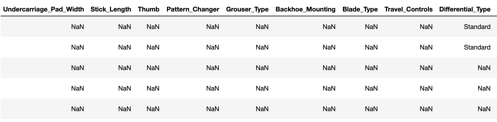
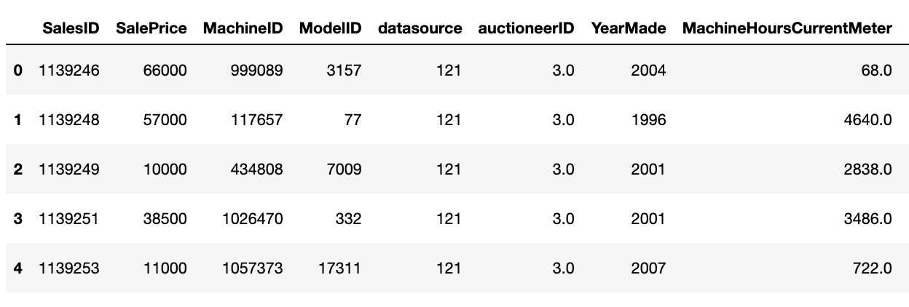

# Sales Price Prediction of Heavy Equipment at Auction

## Overview

The purpose of this project is to predict the sale price of a particular piece of heavy equipment at auction. The prediction is based on a number of features, such as: usage, type, configuration, and age. The data we analyzed is sourced from over 401,000 auction result postings from 1989 - 2011.

## Data
Description of the problem and the data

The auction dataset was over 100MB and contained 53 columns and over 401,000 rows. The data was mainly categorical and contained a large amount of null values. Only 8 of the 53 columns contained numerical data. Most of the data was descriptive of the equipment feature set. The numerical data included information about the transaction, auctioneer, and make / model of the equipment.

Because the dataset was large and messy, it was important to reduce the noise before we tested our models. We accomplished this by created a formatting function that dropped redundant or non-descriptive columns, eliminated null values, reformatted data types, and created dummy columns for our categorical data.

    

    

## Goals and Workflow

Our goal is to provide a reliable and flexible model that accurately predicts the sale price of a particular piece of heavy equipment.

Before we started working with the data we established a shared repository and mapped our directories, which included the data, our source code files, and presentation materials. This was an important first step that greatly increased our organization and collaboration.

Next, we set up a live share working environment and began to analyze the data. We performed EDA as a group, which was a useful strategy because it enabled us to establish a better understanding of the data more quickly. We continued to work as a group during the next phase of our project, which was data cleaning. It was also useful to perform this phase as a group because it enabled us to quickly address problems in our source code.

After our EDA and cleaning, we decided to split the remaining workload. 

Noah - Lasso\
George - Ridge\
Jerome - Model support\
Raffi - README / git / model support\

## Model and Performance
What you accomplished (how you chose model, performance metric, validation)

Performance on unseen data

Anything new you learned along the way

